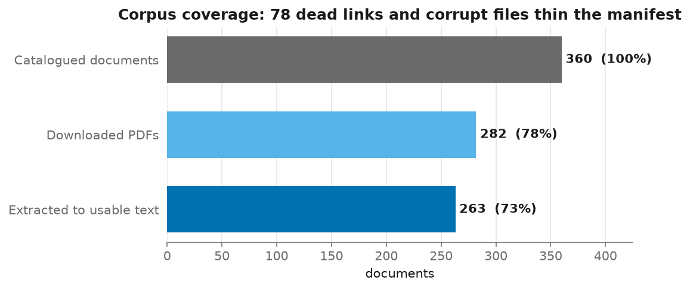
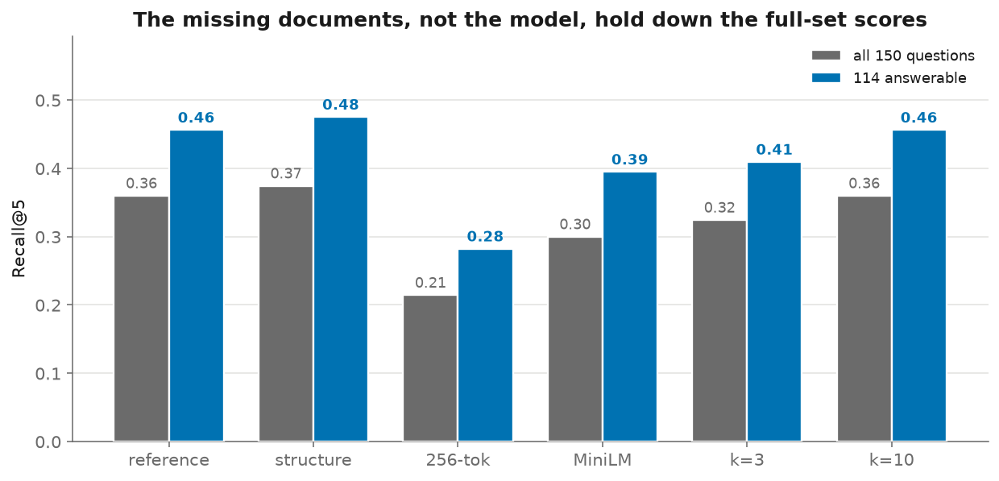
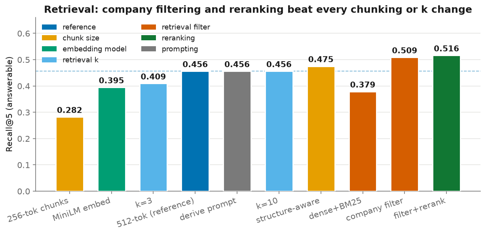
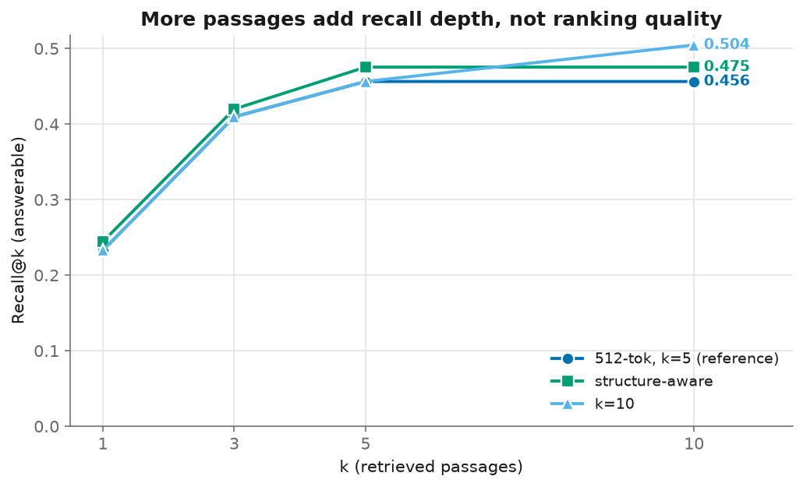
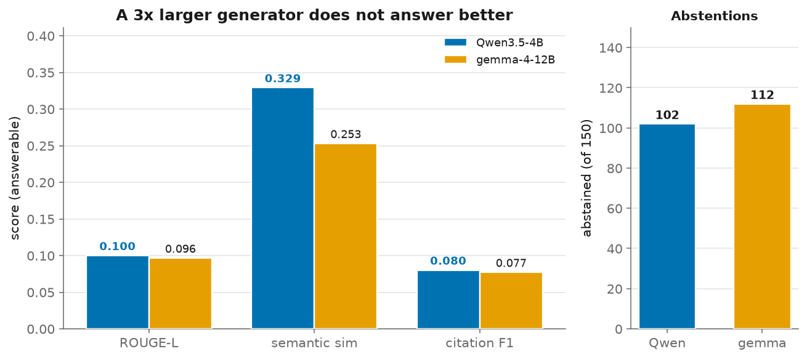
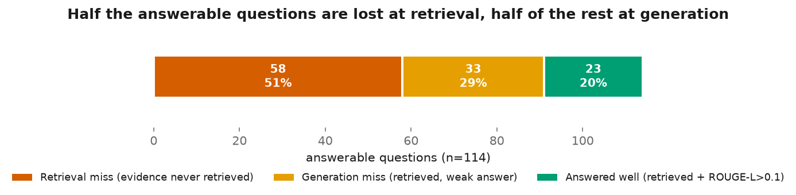
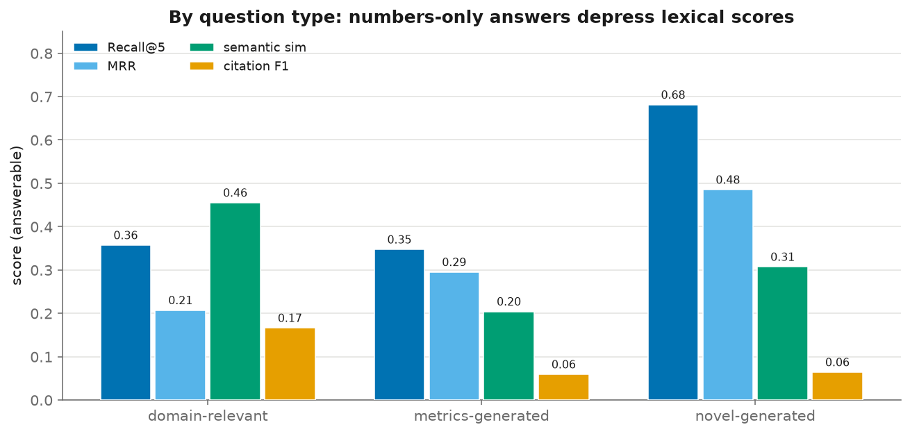

# Building and Evaluating a Retrieval-Augmented Generation System on FinanceBench

Karthik Reddy Changal, Chaithanya Anugu, Nithin Sujith Nair

## Abstract

We build and evaluate a retrieval-augmented generation (RAG) pipeline that answers questions
about financial filings using only a closed collection of SEC documents, on free models that
run locally. We compare configurations across chunk strategy, retrieved-passage count,
embedding model, generation model, retrieval filtering, cross-encoder reranking, and prompting.
On the 114 questions whose source document is available, the best configuration restricts
retrieval to the company named in the question and reorders a deep candidate pool with a
cross-encoder, reaching Recall@5 0.52 against 0.46 for pure dense search. The headline result is
methodological: measured by Recall@5 the company filter supplies 88% of the gain and reranking
only 12%, but measured by whether the system answers correctly the shares are almost exactly
reversed, because reranking raises how often the right filing reaches the generator without
moving the token-overlap score the retrieval metric is built on. Reranking doubles the number of
correct answers; a BM25 hybrid, a three-times-larger generator and a prompt written to reduce
refusals all fail to help. Generation remains the weaker stage, and the system declines to answer
rather than inventing figures on roughly two-thirds of questions. We report every metric over
both the full 150-question set and the answerable subset, because a fifth of the FinanceBench
corpus no longer downloads, and we treat that coverage gap as a result rather than hiding it.

## 1. Introduction

### 1.1 Problem statement

Financial filings are long and table-heavy; a 10-K runs past 100 pages, and the target fact
(a capital expenditure, a segment's growth) usually sits in one row of one table. Answering a
question has two parts: finding the passage with the fact, and reading it correctly. General
model knowledge does not help, because the answer is specific to one company and year and must
come from the document. Retrieval-augmented generation (RAG) matches this: a retriever selects
a few relevant passages and a language model writes a cited answer from them.

### 1.2 Related work

RAG pairs a dense retriever with a generator so a model answers from an external corpus rather
than its parameters (Lewis et al., 2020). Passages and query are embedded into one vector space
and compared by similarity. We use FinanceBench (Islam et al., 2023), which gives each question
a gold answer and the exact evidence span it draws on, so we can measure both answer quality
and whether retrieval found the right passage.

Retrieval is scored by whether the gold evidence appears among the retrieved passages (Recall@k,
MRR); generation against the reference answer (ROUGE, semantic similarity, or an LLM judge such
as RAGAS). We do not use an LLM judge: it adds a second large model and ties scores to the
judge's quirks. We use lexical and semantic overlap plus a citation-validity check instead.

### 1.3 Contributions

We build a RAG question-answering pipeline that runs end to end on free, local models, and ablate
seven design decisions (chunk strategy, retrieved-passage count, embedding model, generation
model, retrieval filtering, cross-encoder reranking, and prompting) one variable at a time.
Because much of the FinanceBench corpus no longer downloads, we report every metric over both the
full question set and the answerable subset, and treat the gap as a result. Two findings follow.
Retrieval, not generation, is the binding constraint: the best configuration finds the gold
evidence for barely half the answerable questions. And the retrieval metric itself is an
unreliable guide to which changes help, ranking the two interventions we tested in the opposite
order to their effect on answer quality, which is a caution for anyone tuning a RAG system
against Recall@k alone.

## 2. Methodology

### 2.1 Dataset

We use FinanceBench, distributed as two JSONL files linked by `doc_name`. The document
catalogue lists 360 filings; the question file holds 150 questions with gold answers and the
evidence text each answer is drawn from.

The filings span several document types (269 10-Ks, 30 8-Ks, 29 earnings releases, 27 10-Qs,
6 annual reports) across eight GICS sectors, led by Information Technology (80), Consumer
Discretionary (77), and Consumer Staples (63). The 150 questions divide evenly into three
types: metrics-generated, domain-relevant, and novel-generated (50 each). By reasoning type,
43 need numerical reasoning, 31 are information extraction, and the rest mix numerical and
logical reasoning. Answers range from single dollar figures ("$1577.00") to short explanatory
sentences.

**Corpus coverage.** Only 282 of the 360 catalogued PDFs still download; the other 78 URLs
return timeouts, 404s, or 403s from the filers' investor-relations hosts. A further set of
downloaded files are corrupt (for example the AMD 10-Ks, which lack a valid PDF root object)
or are near-empty stubs, so text extraction succeeds for 263 documents. After extraction, 114
of the 150 questions reference a document that yields usable text; the remaining 36 point at a
missing or corrupt filing and cannot be answered from the corpus. We therefore report each
metric twice: over all 150 questions, and over this 114-question answerable subset. The first
figure describes the system against the corpus as it exists today; the second isolates the
quality of retrieval and generation from missing inputs. Figure 1 traces the decay from the
full manifest to the documents that yield usable text.

**Figure 1. Corpus coverage.** Of 360 catalogued filings, 282 still download and 263 extract
to usable text, leaving 114 of the 150 questions answerable from the local corpus.

### 2.2 System architecture

The pipeline has four stages: document processing (`src/data_processing`), retrieval
(`src/retrieval`), generation (`src/generation`), and evaluation (`src/evaluation`), tied
together by `run_experiments.py`. Each stage writes its output to disk so later stages and
repeated runs reuse it.

### 2.3 Document processing

PDFs are downloaded from the catalogue URLs with SEC-compliant headers and retry logic
(`download_pdfs.py`). Text is extracted with pdfplumber, which recovers both body text and
table content, the latter mattering for filings where the answer sits in a financial
statement. Extraction is cached per document so that the three chunk strategies do not each
re-parse the same PDF; this turns roughly four and a half hours of repeated extraction into a
single ninety-minute pass. Extracted text is cleaned to normalise whitespace and de-hyphenate
line breaks before chunking.

### 2.4 Chunking strategies

We compare three strategies: fixed windows of 256 tokens with 32-token overlap, fixed windows
of 512 tokens with 64-token overlap, and a structure-aware strategy that packs whole sentences
up to a 512-token limit so a chunk never ends mid-sentence. Overlap in the fixed strategies
preserves sentences that straddle a boundary. Each chunk carries its document name, company,
sector, period, and a chunk index used to build citation tags.

### 2.5 Embedding models

The baseline embedding model is BAAI/bge-base-en-v1.5 (768 dimensions). We compare it against
all-MiniLM-L6-v2 (384 dimensions), which is smaller and faster, to measure what the larger
model buys in retrieval quality. Embeddings are normalised and indexed for inner-product
search, which for unit vectors is cosine similarity.

### 2.6 Retrieval

Chunks are embedded and stored in a FAISS flat inner-product index, one index per embedding
model and chunk strategy. At query time the question is embedded with the same model and the
top-k chunks are returned. We vary k over 3, 5, and 10. Beyond plain dense search we test three
retrieval strategies (Section 4.2): restricting the candidates to the company named in the
question, fusing the dense ranking with a BM25 lexical ranking, and reranking. The reranker
retrieves a pool of 50 candidates and reorders them with bge-reranker-base, a cross-encoder that
scores a question and a passage together rather than embedding them separately, which is slower
but sensitive to whether a passage answers the question rather than merely resembling it. It runs
locally like the rest of the pipeline.

### 2.7 Generation

Answers are generated by Qwen3.5-4B, run as 4-bit GGUF weights through llama.cpp with Metal
acceleration on Apple silicon. (The brief's suggested Llama-3.1-8B with bitsandbytes 4-bit
loading is not usable here, since bitsandbytes has no macOS build; llama.cpp provides the
equivalent quantised local inference.) The generator receives the retrieved passages, each
prefixed with its citation tag, and is instructed to answer only from them, cite each claim,
and say when the passages do not contain the answer. As a second generator we compare against
gemma-4-12B, a larger model from a different family. Decoding uses temperature 0.1 for
near-deterministic extraction.

### 2.8 Evaluation metrics

Retrieval is scored with Recall@k, Precision@k, and mean reciprocal rank; a retrieved chunk
counts as matching the gold evidence when it covers at least half of the evidence's content
words (Section 5.2). Generation is scored with ROUGE-L, embedding-based semantic similarity,
and exact match against the gold answer. Citation quality is precision, recall, and F1 over the
`[DOCNAME_c<index>]` tags, each checked against the passages actually retrieved.

## 3. Experimental setup

### 3.1 Implementation

The pipeline is Python 3.12. Retrieval uses sentence-transformers and faiss-cpu; generation
uses llama-cpp-python built with Metal; evaluation uses rapidfuzz, rouge-score, and
sentence-transformers. Embedding runs on the Apple GPU through MPS. Hardware: Apple M4 Pro,
24 GB unified memory. Full versions are pinned in `requirements.txt`.

### 3.2 Ablation design

One configuration is the reference (512-token chunks, bge-base embeddings, k=5, Qwen3.5-4B), the
baseline against which the others are read. Each other run changes one variable so its effect is
isolated: chunk strategy (256-token and structure-aware), k (3 and 10), embedding model
(MiniLM), generator (gemma-4-12B), retrieval strategy (company metadata filtering, a dense + BM25
hybrid, and cross-encoder reranking over a company-filtered pool), and the generator's
instructions (a prompt that permits deriving figures and showing arithmetic). The experiment
matrix is `configs/experiments.yaml`. Indexes are cached and shared across runs, so each
embedding-model-and-strategy pair is built once.

Two arms deliberately change two things at once, so a third separates them. Reranking is applied
on top of the company filter rather than alone, because the pool the cross-encoder reorders is
worth more when it is already restricted to the right company; the filter is therefore also run
with generation enabled so its contribution can be measured on its own (Table 2).

## 4. Results

All figures referenced here are in `results/figures/`, and the full per-configuration tables
are in `results/results_summary.md`. Retrieval numbers are on the 114-question answerable
subset unless stated; the answerable-versus-all gap is reported separately in Section 4.1.

### 4.1 Overall performance

The reference configuration (512-token chunks, bge-base embeddings, k=5, Qwen3.5-4B) retrieves
the gold evidence into its top 5 passages for 45.6% of answerable questions, with a mean
reciprocal rank of 0.323. Over all 150 questions, including the 36 whose document is missing or
corrupt, Recall@5 falls to 0.360. The gap between 0.360 and 0.456 is almost entirely the
missing documents: those questions can never be retrieved, so they enter the full-set average
as zeros. This is why we carry both numbers throughout, and Figure 2 shows the gap for every
configuration.

**Figure 2. Recall@5 over all 150 questions against the 114 answerable.** The gap is roughly
constant across configurations, which is what we expect if it comes from missing data rather
than from any one design choice.

Table 1 gives retrieval quality for every configuration on the answerable subset,
ordered by Recall@5.

**Table 1. Retrieval metrics on the 114-question answerable subset.**

| Configuration | Ablation axis | Recall@1 | Recall@5 | Recall@10 | MRR |
| --- | --- | --- | --- | --- | --- |
| company filter + reranking | reranking | 0.249 | **0.516** | 0.516 | **0.360** |
| company filter | retrieval filter | 0.259 | 0.509 | 0.509 | 0.358 |
| structure-aware chunks | chunk size | 0.244 | 0.475 | 0.475 | 0.333 |
| 512-token chunks (reference) | reference | 0.232 | 0.456 | 0.456 | 0.323 |
| k = 10 | retrieval k | 0.232 | 0.456 | 0.504 | 0.329 |
| derive prompt | prompting | 0.232 | 0.456 | 0.456 | 0.323 |
| k = 3 | retrieval k | 0.232 | 0.409 | 0.409 | 0.311 |
| MiniLM embeddings | embedding model | 0.149 | 0.395 | 0.395 | 0.243 |
| dense + BM25 hybrid | retrieval filter | 0.124 | 0.379 | 0.379 | 0.218 |
| 256-token chunks | chunk size | 0.161 | 0.282 | 0.282 | 0.203 |

The derive-prompt run changes only the generator's instructions, so its retrieval scores are
identical to the reference by construction; it appears here for completeness and is discussed in
Section 4.2.

Generation is weaker and limited by retrieval. On the answerable subset the reference system
reaches ROUGE-L 0.10 and semantic similarity 0.33, and declines to answer on 102 of 150
questions. The abstention rate follows from retrieval: when the
evidence does not reach the model, the prompt tells it to refuse, so a retrieval miss becomes an
abstention rather than a wrong figure.

### 4.2 Ablation analysis

Figure 3 collects the whole ablation into one panel, colouring each configuration by the axis
it varies.

**Figure 3. Recall@5 by configuration, coloured by ablation axis.** The dashed line marks the
reference. Company filtering followed by reranking gives the highest score; structure-aware
chunking is the best of the content-only changes. The derive-prompt run sits exactly on the
reference line because it changes only the generator's instructions.

#### Chunk size and structure

Chunking has the largest effect on retrieval of any axis we varied. Cutting the fixed window
from 512 to 256 tokens is clearly harmful: Recall@5 drops from 0.456 to 0.282 and MRR from
0.323 to 0.203. Smaller chunks split a table or a paragraph across more pieces, so the
evidence for a question is spread thinner and a single retrieved chunk covers less of it. The
structure-aware strategy, which packs whole sentences up to the 512-token limit so a chunk
never ends mid-sentence, is the best of the three: Recall@5 rises to 0.475 and MRR to 0.333,
just above the 512-token baseline, though the margin over it is small.

#### Embedding model

The larger embedding model helps. Swapping bge-base (768 dimensions) for all-MiniLM-L6-v2 (384
dimensions) lowers Recall@5 from 0.456 to 0.395 and MRR from 0.323 to 0.243, on the same chunks
and questions. MiniLM is faster and a third of the dimensionality, but on terse financial
questions where the answer is one row of a table, bge-base finds that row more often.

#### Retrieval k

Increasing k mostly buys recall depth, not rank quality. Moving from k=5 to k=10 leaves
Recall@5 unchanged at 0.456 (the same top-5 passages are retrieved) but lifts Recall@10 to
0.504, so a handful of questions have their evidence sitting in positions 6 through 10. MRR
barely moves (0.323 to 0.329), meaning the rank of the first correct passage is stable. At the
other end, k=3 lowers recall to 0.409 because fewer passages are retrieved. For the generator k
is a trade-off: more passages raise the chance the evidence is present but also add distractors
to the prompt. Figure 4 shows the recall-versus-k curves.

**Figure 4. Recall@k for the reference, the structure-aware chunker, and k=10.** Raising k
lifts the tail of the curve (Recall@10) without changing where the first correct passage lands.

#### Retrieval filtering and hybrid search

The content-only changes above move Recall@5 within a narrow band (0.28 to 0.48), which fits
the picture that dense similarity over the whole corpus is the ceiling. Two changes attack that
ceiling directly. Each FinanceBench question names its target company, and every chunk carries
that company in its metadata, so we can restrict the search to the chunks of the company named
in the question (inferred from the question text, never the gold answer). This company filter
is the single best configuration: Recall@5 rises to 0.509 and MRR to 0.358, above every
chunking, k, or embedding change. The gain is bounded by company extraction, a simple
name-match catches the company in about 85% of questions, so the remaining misses inherit the
unfiltered behaviour; a better entity extractor would raise it further.

Hybrid retrieval, fusing the dense ranking with a BM25 lexical ranking by reciprocal rank
fusion, does the opposite: Recall@5 falls to 0.379, below the reference. On these filings BM25
rewards shared boilerplate vocabulary, and the natural-language question terms rarely match the
tabular numbers that hold the answer, so the lexical signal adds noise rather than precision. A
useful negative result: not every standard retrieval add-on helps on this corpus.

#### Reranking, and what the retrieval metric cannot see

Recall keeps climbing well past k=10: under the company filter it reaches 0.583 at k=10, 0.702 at
k=20 and 0.801 at k=50. The evidence is therefore usually inside a deep candidate pool and simply
ranked too low, which is what a cross-encoder is for. We retrieve a company-filtered pool of 50
and reorder it with bge-reranker-base, a locally run cross-encoder that scores each
question-and-passage pair jointly.

By Recall@5 this looks like almost nothing: 0.509 to 0.516, a gain of 0.007 against an available
0.29. By answer quality it is the largest single improvement in this study. Because gold answers
are frequently bare figures, we also score numeric agreement, counting an answer correct when a
gold figure appears in it (years excluded, 0.5% tolerance). On that measure reranking takes the
system from 0.095 to 0.190, doubling the number of correct answers from 8 to 16, significant by a
McNemar exact test (p = 0.039). Abstentions fall from 102 to 89 of 150, and the model is also
more accurate on the questions it does attempt.

Running the company filter with generation separates the two changes, and the result inverts the
retrieval picture:

**Table 2. Where the gain actually comes from, answerable subset.**

| Component | Share of Recall@5 gain | Share of answer-quality gain |
| --- | --- | --- |
| company filter | +0.053 (88%) | +0.012 (12%) |
| cross-encoder reranking | +0.007 (12%) | +0.083 (87%) |

The retrieval metric ranks these two interventions in the opposite order to their effect on
answers. The reason is visible in a direct measurement: reranking lifts the rate at which the
correct filing appears in the top 5 from 0.605 to 0.746, while barely moving the token-overlap
score the metric is built on. Getting the right document in front of the generator is what the
generator needs, and Recall@5 as defined here is close to blind to it.

Two cases make this concrete. Asked for 3M's FY2018 capital expenditure (gold $1,577m), the
filtered system answered "$1,493 million" from a 2015 filing and the reranked system answered
"$1,577 million" from the 2020 filing; both scored Recall@5 of 0.00. Asked for Amazon's FY2019
net income (gold $11,588m), both scored Recall@5 of 1.00, but the filtered system answered
"$33,364 million" and the reranked system "$11,588 million". Of the nine questions reranking
fixed, Recall@5 improved on only three.

Reranking is not uniformly better: it also caused two questions that were previously answered
correctly to be refused. The trade is nine gained against two lost.

#### Prompting and abstention

The system refuses on 102 of 150 questions, and on 40% of questions whose evidence was
successfully retrieved, which suggests instructions rather than evidence are the binding
constraint for some of them. Inspection supported this: asked for a capital-expenditure figure,
the model replied that the excerpts did not contain it "in a cash flow statement format", a
refusal about presentation rather than absence. We therefore tested a second prompt that states
that deriving a figure from inputs present in the excerpts is a valid answer, permits one line of
arithmetic, and demotes refusal from the first rule to the last.

It does not work. Refusals move from 102 to 100 of 150 and numeric agreement from 0.095 to 0.119,
a difference of two questions (p = 0.50). The model largely rephrases its refusals rather than
attempting more answers, which also exposed a measurement bug: our abstention counter matched
only the exact instructed refusal string, so reworded refusals were being counted as attempts.
Correcting it raised the reference system's abstention count from 99 to 102 and is the reason the
figures here differ from an earlier version of this report. Accuracy on the questions the model
does answer improves (0.242 to 0.278), so permitting arithmetic plausibly helps once it commits;
it simply does not make it commit more often. We report this as a negative result.

#### Generation model

Making the generator larger does not help. Holding retrieval fixed at the reference setup and
swapping Qwen3.5-4B for gemma-4-12B, a model three times the size from a different family, moves
none of the generation metrics in gemma's favour: ROUGE-L is 0.096 against Qwen's 0.100,
semantic similarity is lower (0.253 against 0.329), and citation F1 is level (0.077 against
0.080). gemma only declines more often, on 112 of 150 questions against Qwen's 102 (Figure 5).
Given identical retrieval, the larger model is more conservative about answering from passages
that may not contain the fact, which makes little difference to the scores. This fits the rest
of the ablation: when the evidence reaches the model less than half the time, a bigger generator
has little to work with. gemma-4-12B also runs at roughly a third of Qwen's tokens per second on
the same GPU, so it is the more expensive of the two for no measured benefit.

**Table 3. Generation and citation metrics, answerable subset.** Numeric agreement counts an
answer correct when a gold figure appears in it, and is reported because ROUGE-L cannot score a
bare figure: metrics-generated questions score 0.001 on ROUGE-L whatever the answer.

| Configuration | Generator | ROUGE-L | Semantic sim | Numeric agr. | Citation F1 | Declined (of 150) |
| --- | --- | --- | --- | --- | --- | --- |
| reference | Qwen3.5-4B | 0.100 | 0.329 | 0.095 | 0.080 | 102 |
| 256-token chunks | Qwen3.5-4B | 0.101 | 0.306 | 0.107 | 0.113 | 105 |
| structure-aware | Qwen3.5-4B | 0.102 | 0.321 | 0.107 | 0.070 | 108 |
| derive prompt | Qwen3.5-4B | 0.084 | 0.329 | 0.119 | 0.245 | 100 |
| company filter | Qwen3.5-4B | 0.105 | 0.355 | 0.107 | 0.214 | 95 |
| **company filter + reranking** | Qwen3.5-4B | **0.116** | **0.380** | **0.190** | 0.130 | **89** |
| gen_gemma | gemma-4-12B | 0.096 | 0.253 | 0.095 | 0.077 | 112 |

**Figure 5. Qwen3.5-4B against gemma-4-12B on identical retrieval.** The larger generator
matches or trails on every metric and abstains more.

### 4.3 Error analysis

Splitting the answerable questions by where they fail is more informative than the aggregate
scores. For the reference configuration, the gold evidence reaches the top 5 passages for 56 of
114 answerable questions (49%); the other 58 are retrieval misses, where the model never sees
the passage it needs. Among the 56 where retrieval succeeds, the generator still produces a
recognisable answer (ROUGE-L above 0.1) only 23 times. So the two failure modes are of similar
size, as Figure 6 lays out: roughly half of the answerable questions are lost at retrieval, and
of the half that survive retrieval, fewer than half are answered well. Improving either stage
alone would leave most of the gap in place.

**Figure 6. Where the 114 answerable questions are lost.** 51% never retrieve the evidence,
29% retrieve it but answer weakly, and 20% are answered well.

The failures also split by question type (Figure 7). Novel questions are the easiest to
retrieve for, with Recall@5 of 0.68, well above the domain-relevant (0.36) and
metrics-generated (0.35) types. Metrics-generated questions expose a measurement artifact as
much as a model failure: their gold answers are bare figures like "$1577.00", so ROUGE-L
against the generated sentence is near zero (0.001) even when the number is arguably present,
and semantic similarity (0.204) is the more honest signal for them. Domain-relevant questions,
whose answers are short sentences rather than single numbers, score highest on semantic
similarity (0.455), which fits: lexical and semantic overlap reward sentence answers and
penalise bare numbers, regardless of correctness.

**Figure 7. Reference-run metrics by question type, answerable subset.** Metrics-generated
questions score near zero on ROUGE-L because their answers are bare numbers.

**Table 4. Reference run by question type (answerable subset).**

| Question type | Recall@5 | MRR | ROUGE-L | Semantic sim | Citation F1 |
| --- | --- | --- | --- | --- | --- |
| domain-relevant | 0.357 | 0.207 | 0.154 | 0.455 | 0.166 |
| metrics-generated | 0.347 | 0.295 | 0.001 | 0.204 | 0.059 |
| novel-generated | 0.681 | 0.485 | 0.135 | 0.307 | 0.064 |

## 5. Discussion

### 5.1 Key findings

Retrieval is the binding constraint. Among content-only changes the larger embedding model and
structure-aware chunking help while halving the chunk beats nothing, but they all stay within a
narrow band, which says pure dense search over the whole corpus is close to its ceiling. Two
changes raise it, and both use structure the corpus already carries rather than a bigger model:
restricting retrieval to the company named in the question, and reordering a deep candidate pool
with a cross-encoder. Together they give the best configuration at Recall@5 0.52 and double the
number of questions answered correctly. A generic BM25 hybrid instead hurts, because financial
filings share boilerplate that the lexical signal over-weights, and a three-times-larger
generator on identical retrieval changes nothing, which confirms the constraint is upstream.

The second finding concerns measurement. Recall@5 credits the company filter with 88% of the
retrieval gain and reranking with 12%; on whether the system answers correctly those shares
reverse. A metric that asks whether one chunk shares half its content words with a gold span
cannot see reordering, and reordering is what determines whether the right filing reaches the
generator. Tuning against Recall@k alone would have led us to keep the weaker change and drop the
stronger one. ROUGE-L has the same defect on the generation side, scoring 0.001 wherever the gold
answer is a bare figure.

Reporting the answerable subset separately matters too: it turns the reference system's Recall@5
from 0.36 over all questions into 0.46 on the questions whose document is present. That gap is
data, not model.

### 5.2 Limitations

Corpus coverage is the largest limitation: a fifth of the filings no longer download and a
further set are corrupt, so 36 of the 150 questions ask about a document the system never sees.
Reporting the answerable subset keeps that gap apart from model quality, but the smaller subset
also makes the per-type numbers noisier.

The retrieval metric is a proxy. It counts a chunk as relevant when it contains at least half
of the evidence passage's content words, which handles the length mismatch that breaks
exact-span or whole-string matching, but it can still credit a chunk that shares vocabulary
without the specific figure, or miss a paraphrase. The 0.5 threshold is defensible rather than
tuned.

Generation uses small 4-bit models so the pipeline runs locally and for free, so absolute
answer quality trails a larger hosted model, especially on arithmetic over a table. Because the
models refuse when the passages do not support an answer, most error surfaces as abstention, the
safer failure here but still a ceiling on how many questions get answered. Generation itself is
reproducible: re-running a configuration returns bit-identical answers, and so identical ROUGE-L
and exact-match scores. An earlier version of this report attributed observed run-to-run drift to
the llama.cpp Metal backend, which was wrong. The drift came from our own citation-recall metric,
which sampled keywords from a Python set and so depended on per-process hash ordering; the same
answer scored differently on each run. That is fixed, but the citation figures reported here
predate the fix and are one draw from that distribution, so citation F1 should be read as
indicative rather than exact. Citation precision is unaffected and is the reliable citation
number. We report a single run per configuration, so small differences between close
configurations should still be read with care. Finally,
pdfplumber recovers table text but flattens its row and column structure, one likely reason
table-heavy numerical questions are hardest.

### 5.3 Generalisability

The pipeline is not specific to finance. Any closed PDF corpus with question-and-evidence data
runs the same way; only the table-aware extraction and citation-tag format are tuned to filings.
The methodological point transfers: when a benchmark's source corpus decays, as FinanceBench's
links have, an evaluation that does not separate missing data from model error understates the
system.

## 6. Conclusion

We built a RAG question-answering pipeline for financial filings on free, local models, and
measured how chunking, k, embedding model, generator, retrieval filtering, reranking and
prompting affect performance on FinanceBench. Retrieval sets the ceiling: the gold evidence
reaches the model for barely half the answerable questions, and the content-only knobs move it
little. What helped was structure the corpus already carries, not a bigger model. Filtering to
the company named in the question and then reordering a deep pool with a cross-encoder together
lift Recall@5 from 0.46 to 0.52 and double the number of questions answered correctly, from 8 to
16. A BM25 hybrid hurt, a larger generator did nothing, and a prompt written to make the model
refuse less simply made it rephrase its refusals. The small 4-bit generators mostly fail safe,
declining rather than inventing figures.

The finding that generalises is about measurement. Ranked by Recall@5 the company filter is worth
seven times what reranking is worth; ranked by whether the system answers correctly, reranking is
worth seven times the filter. Trusting the retrieval metric would have meant keeping the weaker
change and dropping the stronger one.

Three directions follow. An exact-span evidence metric would replace the token-coverage proxy
that produced the inversion above. Reranking has more to give, since Recall@50 under the company
filter is 0.80 against the 0.52 currently reaching the generator, so a stronger cross-encoder or
a deeper pool should convert more of that gap. And recovering the missing corpus would let the
full-set numbers measure the model rather than the dataset's decay.

## References

Islam, P. et al. (2023). FinanceBench: A New Benchmark for Financial Question Answering.
https://github.com/patronus-ai/financebench

## Appendix

Reproduction instructions are in `README.md`. Per-configuration metrics and detailed
per-question results are in `results/experiments/`.
